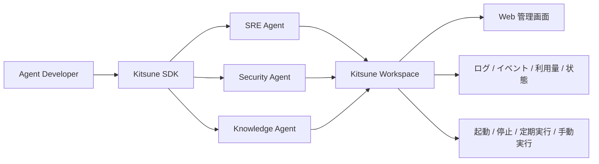
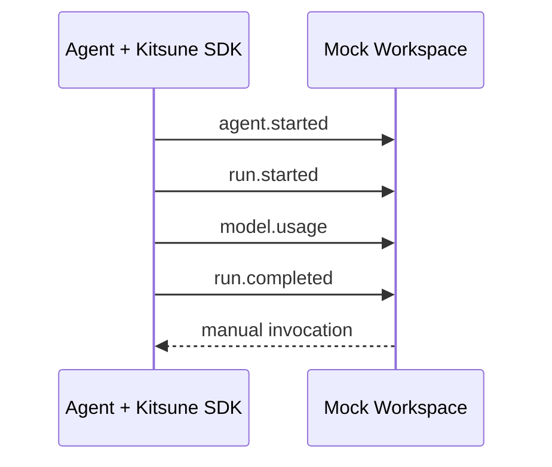

# Kitsune

Kitsune は、複数の AI Agent を **作りやすくし、運用しやすくする**ための基盤を検討するプロジェクトです。

このリポジトリは実装を急ぐためのものではなく、Kitsune の責務・境界・拡張方法を検証するための設計リポジトリです。コードは設計を確認するためのモックに限定しています。

## 目的

AI Agent を作ると、Agent 固有の推論や Tool 以外に、次のような処理が繰り返し必要になります。

- 起動・終了処理
- 設定読み込み
- ログ・イベント・トレース
- LLM 利用量やコストの記録
- 定期実行やイベント起動
- Slack / HTTP / Alert など外部との接続
- Sub-agent の呼び出し
- MCP や共通ライブラリの組み込み
- 本番環境での状態確認、実行履歴確認、手動実行

Kitsune は、これらを一つの巨大な Agent Framework として抱え込むのではなく、**開発側の SDK** と **運用側の Workspace** に責務を分けます。



## 二つの主要コンポーネント

### Kitsune SDK

Agent プロセスの内側で使う開発者向けライブラリです。

- Agent アプリケーションの起動・終了
- 実行コンテキスト
- 標準イベントの送出
- OpenTelemetry 連携
- モデル設定の補助
- Sub-agent 実行の補助
- プラグイン機構
- MCP や外部ライブラリを組み込むための補助

Pydantic AI や LangChain を置き換えることは目的にしません。標準構成として Pydantic AI を優先してよいものの、Kitsune SDK は Agent の知能部分を独占しません。

### Kitsune Workspace

複数 Agent の **制御・管理面**です。

- Agent 登録と一覧
- 起動状態の把握
- 起動方式の管理
- 実行履歴の集約
- ログ・イベント・利用量の集約
- Web からの状態確認
- 手動実行
- 将来的な実行環境アダプター

Agent 同士の知的な連携方法を Workspace が決めることは原則としません。

## 設計原則

1. **SDK と Workspace の責務を分離する。**
2. **SDK は Workspace がなくても利用できる。**
3. **Workspace は SDK を使わない既存 Agent も将来的に管理できる余地を残す。**
4. **Agent 間の連携判断は Agent / SDK 側に置く。**
5. **起動・停止・定期実行・実行履歴の管理は Workspace 側に寄せる。**
6. **イベントを生成するコードは SDK、集約・保存・表示は Workspace とする。**
7. **Tool の共通 API は作らない。** 再利用したいコードは Utility Library、Tool は各 Agent / MCP / 利用 Framework に任せる。
8. **プラグインは SDK の第一級機能とする。** ただし介入点は明示的に限定する。
9. **将来の未知の要件に備えるが、未使用機能を先回りして実装しない。**
10. **Agent 群の協調方式を Swarm に固定しない。** 独立、常駐、定期、イベント駆動、同期的委譲などを別概念として扱う。

## ドキュメント

- [全体アーキテクチャ](docs/architecture.md)
- [Kitsune SDK](docs/sdk.md)
- [Kitsune Workspace](docs/workspace.md)
- [プラグイン機構](docs/plugins.md)
- [Agent の起動方式](docs/activation.md)
- [イベント・ログ・観測性](docs/observability.md)
- [Utility / Tool / MCP の境界](docs/tooling.md)
- [モックと検証シナリオ](docs/mock.md)
- [非目標と判断基準](docs/non-goals.md)

## モック

`mock/` には、設計を説明するだけの Python モックがあります。

```bash
cd mock
python -m examples.demo
```

モックが示すのは次の流れだけです。



実際の LLM、Pydantic AI、Slack、データベース等には接続しません。

## 現在の位置付け

このリポジトリは仕様確定前の設計土台です。特に以下は未決定事項として残します。

- SDK / Workspace 間の本番向け通信方法
- Workspace の永続化方式
- Agent 実行環境の具体的な管理方式
- Web UI の技術選定
- Pydantic AI 以外の Framework をどこまで正式対応するか
- Agent 間の非同期連携を Workspace がどこまで補助するか

これらは実利用で必要性が確認された時点で決定します。
