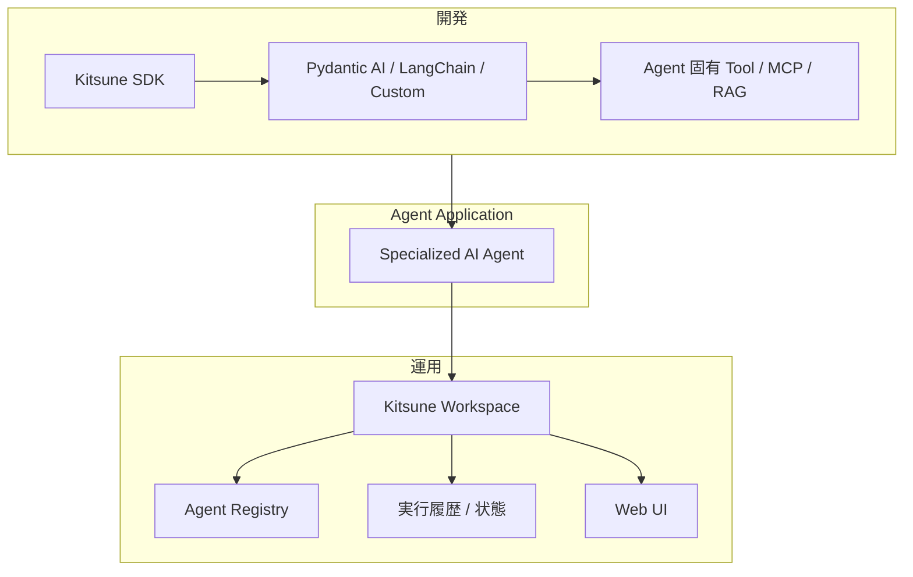
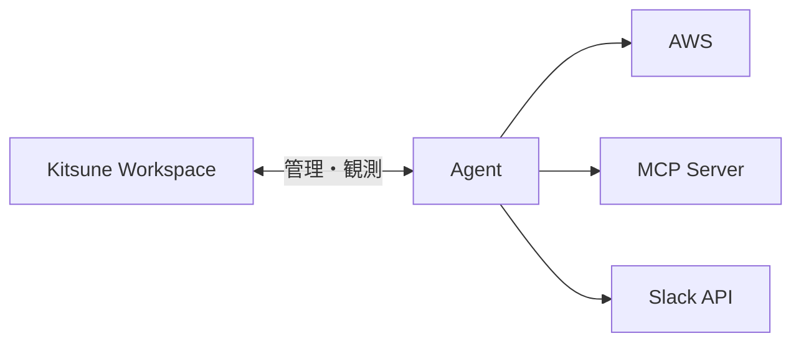
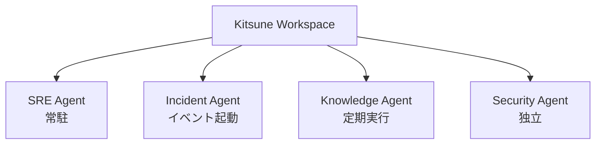

# 全体アーキテクチャ

## 1. 基本的な考え方

Kitsune は一つの巨大な AI Agent Framework ではない。

開発時と運用時の課題を分ける。

## 2. SDK と Workspace の境界

### SDK が所有するもの

Agent プロセス内に存在する処理。

- アプリケーション起動・終了フック
- 実行コンテキスト
- 実行識別子
- イベント生成
- ログ・トレース生成
- モデル利用量の取得・イベント化
- プラグイン読み込み
- Sub-agent 実行補助
- Workspace クライアント

### Workspace が所有するもの

複数 Agent を横断して扱う処理。

- Agent の登録情報
- 現在状態
- 起動条件
- 実行履歴
- イベント・ログ・利用量の受信と保存
- Web UI
- 手動実行
- 定期実行
- 実行環境への指示

## 3. 「連携」と「起動」を分離する

Agent の起動方法と Agent 同士の連携方法は異なる。

### 起動方法

Workspace の管理対象になり得る。

- 常駐
- 要求時
- イベント起動
- 定期実行
- 手動実行

### 連携方法

Agent の内部設計に近いため、SDK / Agent 側を基本とする。

- 独立
- 同期的な Sub-agent 呼び出し
- 外部イベント発行
- 将来の Agent-to-Agent 通信

Workspace は「どの Agent を呼ぶべきか」を知的に判断しない。

## 4. Workspace は通信プロキシではない

Workspace は Agent のすべての外部通信を仲介しない。

Agent 固有の Tool、AWS SDK、Slack 検索、MCP 呼び出しは Agent から直接行ってよい。

## 5. Agent 群の考え方

Workspace には複数 Agent が存在できる。

これを必ずしも「Swarm」とは呼ばない。

Swarm は、複数 Agent が協調して一つのタスクを処理する構成パターンの一つでしかない。Workspace はより広く、独立した Agent 群も管理する。

## 6. 重要な非依存性

Kitsune SDK と Workspace は連携するが、相互に必須としない。

- SDK 単体でローカル開発できる。
- Workspace は将来的に Kitsune SDK 未使用の Agent をアダプター経由で管理できる。
- Pydantic AI は標準候補だが、Kitsune の通信・運用モデルと同一視しない。
