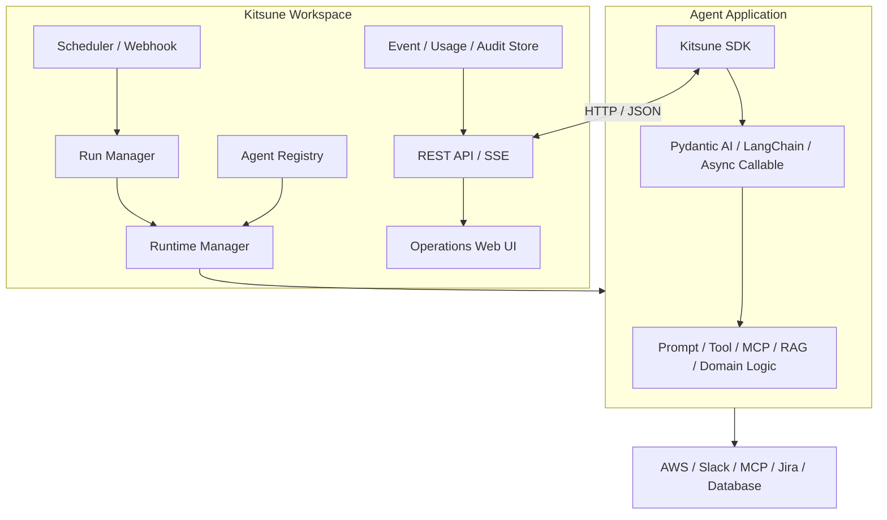

# アーキテクチャ

Kitsune は、Agent Application 内で動く Kitsune SDK と、Agent の外側で動く Kitsune Workspace に分かれます。Pydantic AI、LangChain、独自実装による推論処理は Agent Application が所有します。Workspace は Agent の通信プロキシや推論エンジンにはなりません。

## 責務の境界

| 対象 | 所有する責務 | 所有しない責務 |
| --- | --- | --- |
| Kitsune SDK | ライフサイクル、Handler、Run Context、イベント、プラグイン、OpenTelemetry、Workspace 接続 | Agent Loop、Tool Protocol、Provider API、RAG |
| Kitsune Workspace | Agent 定義、Runtime、Run、Schedule、Webhook、状態、利用量、監査、運用 UI | 外部通信の中継、意味的ルーティング、汎用 Workflow |
| Agent Application | Prompt、Tool、MCP、Framework、外部 API、固有の業務処理 | 複数 Agent を横断する運用制御 |

SDK は Workspace URL がない場合も動きます。Run ID、相関 ID、親 Run ID をローカルで作り、構造化ログと設定済みの OpenTelemetry Exporter へ出力します。Workspace 向けイベントは送信先がないためローカル処理だけで完結します。

## 管理情報の流れ

1. Workspace は設定ディレクトリの YAML を一括検証し、Agent Definition の Snapshot と Hash を保存します。
2. Runtime Adapter は Manifest に宣言された Process、Container、または External endpoint を扱います。
3. 起動した SDK は Agent Descriptor と Handler Schema を登録し、Heartbeat を送ります。
4. Trigger が Run を作成し、Queue と同時実行数の制約を通過した Run が Runtime Instance へ配送されます。
5. SDK は Run の開始、進行、利用量、終了を Event Outbox へ保存し、Workspace へ少なくとも一回配送します。
6. Workspace は Event ID で重複を除き、Run、Usage、Audit を保存して SSE で Web UI へ通知します。

## 単一の制御面

同じデータベースに対して Scheduler と Runtime 管理を行う Active Workspace は一個です。Workspace は起動時に `workspace_locks` の Instance Lock を取得します。分散 Leader Election は実装していません。可用性を高める場合も、同時に Active にするのではなく、前の Instance が停止して Lock が失効してから次を起動します。

## 永続化の境界

Workspace は Agent Definition の Snapshot、Runtime と Run の状態、保存を許可した入力と出力、Event、Usage、Audit、Trace ID、外部 Log/Trace URL を保存します。Agent の Raw Log、Provider の全 HTTP Payload、Secret、Agent Memory、RAG 文書は保存しません。Process と Docker の直近 Log は Runtime Adapter から Tail し、External Agent では URL へ誘導します。
