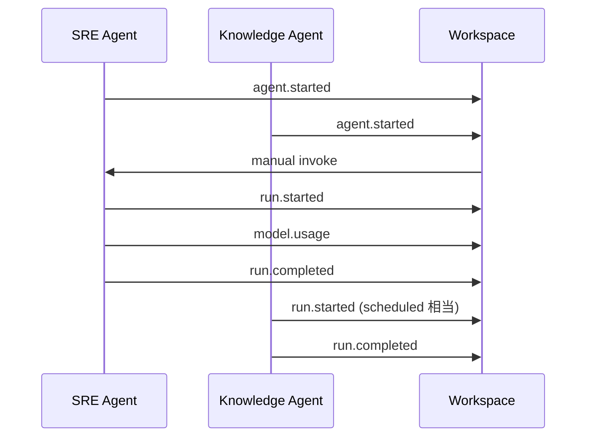

# モックと検証シナリオ

## 1. 目的

実装前に SDK / Workspace の責務をコードで確認する。

モックでは次を検証する。

1. Agent が SDK を利用して標準イベントを出せる。
2. Workspace が複数 Agent のイベントを同じ形式で保持できる。
3. Workspace から Agent を手動実行できる。
4. Plugin が SDK の実行過程に介入できる。
5. Agent 固有処理は Workspace が理解しなくてもよい。

## 2. モック構造

```text
mock/
├── kitsune_mock/
│   ├── sdk.py
│   ├── workspace.py
│   └── plugins.py
└── examples/
    └── demo.py
```

## 3. シナリオ



## 4. モックで検証しないもの

- 実際のコンテナ管理
- LLM 接続
- Pydantic AI
- Slack
- Web UI
- DB
- OpenTelemetry exporter

これらを混ぜると基礎設計の検証が難しくなるため、まず責務だけを確認する。
