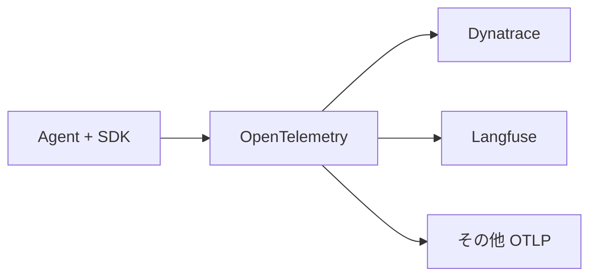

# イベント・ログ・観測性

## 1. 基本分担

```text
SDK
  何を・どの形式で出力するか

Workspace
  受信・保存・検索・集計・表示
```

## 2. SDK の標準イベント

必要最低限に絞る。

```text
agent.started
agent.ready
agent.stopping
agent.stopped

run.started
run.completed
run.failed

model.usage
plugin.loaded
```

共通フィールド候補:

```json
{
  "type": "run.completed",
  "timestamp": "...",
  "agent_id": "sre-agent",
  "run_id": "...",
  "correlation_id": "...",
  "payload": {}
}
```

Agent 固有イベントは `payload` を Workspace が理解せず保存できることが望ましい。

## 3. OpenTelemetry

Kitsune の標準的な観測基盤は OpenTelemetry を中心に考える。



Langfuse はオプション。

Dynatrace 等の一般的な監視基盤にも接続可能な形を維持する。

## 4. Workspace に集約する情報

- Agent 状態
- Run 状態
- Run 開始/終了時刻
- エラー
- Model 利用量
- 推定コスト（取得可能な場合）
- Plugin 情報
- Trace ID
- ログへの導線

生ログを Workspace DB に複製するか、外部ログ基盤への参照だけ保持するかは未決定。

## 5. 重要な原則

Workspace 独自の Observability 形式を作り込みすぎない。

標準イベントは Agent 管理に必要な小さい集合に限定し、詳細な Model / Tool Trace は OpenTelemetry や利用 Framework の既存機構を活用する。
