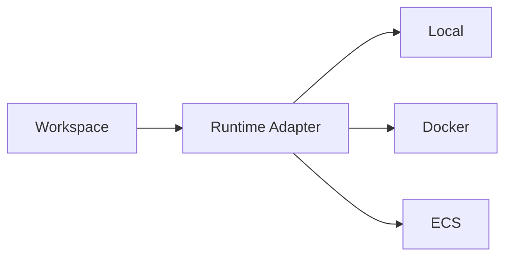

# Kitsune Workspace

## 1. 目的

Kitsune Workspace は、複数 AI Agent を統一した作法で運用するための **制御・管理面**である。

Agent の推論や Tool を管理するものではない。

## 2. 主要機能

### Agent 登録

Workspace は Agent ごとの運用メタデータを保持する。

```yaml
name: sre-agent
display_name: SRE Agent
version: 1.2.0
activation:
  mode: resident
observability:
  events: true
  traces: true
```

### 状態管理

最低限以下を扱う。

- 未起動
- 起動中
- 稼働中
- 停止中
- 停止
- 異常

LLM の状態を意味しない。あくまで Agent Application の運用状態である。

### 実行履歴

```text
Run
├── run_id
├── agent_id
├── trigger
├── started_at
├── ended_at
├── status
├── correlation_id
├── usage
└── error
```

SDK から受け取った情報を保存・表示する。

### Web 管理画面

想定画面:

```text
Agents
------------------------------------------------
SRE Agent          Running       12 runs
Security Agent     Running        3 runs
Knowledge Agent    Scheduled      next 02:00

Recent Runs
------------------------------------------------
05:01 SRE          completed
04:57 Incident     failed
04:00 Knowledge    completed
```

Agent 詳細では以下を表示する。

- 状態
- バージョン
- 起動方式
- 最終実行
- 実行履歴
- 利用量
- ログ/トレースへの導線
- 読み込まれたプラグイン情報
- 手動実行

## 3. Workspace が持たないもの

- Agent の Prompt
- Tool 選択
- RAG
- reasoning
- Sub-agent 選択
- Agent 間の知的なルーティング

## 4. 実行環境

Workspace が直接 Docker / ECS / Kubernetes のすべてを実装する必要はない。

将来的には実行環境アダプターとして扱う。



初期実装は一つに限定してよい。

## 5. Agent 発見

Workspace が複数 Agent の存在・状態を知るため、将来的に SDK から Agent Registry を参照できると便利である。

ただし、

```text
「この依頼は Security Agent に任せるべき」
```

という意味判断は Workspace の責務にしない。
